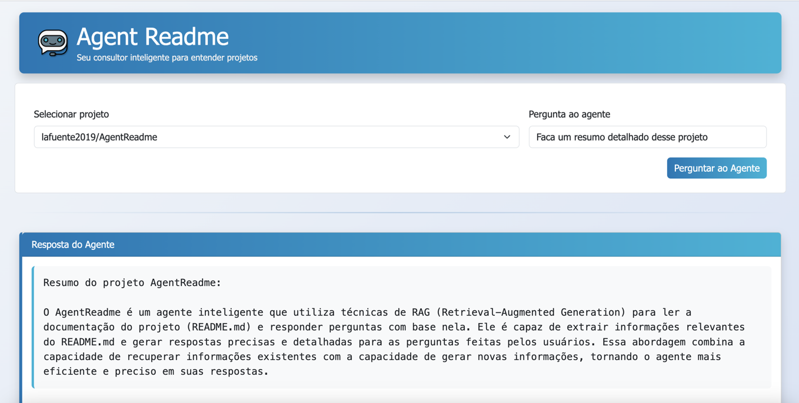

# 🤖 Agent README – Seu Consultor de Projetos com RAG

## 🎯 Objetivo do Projeto

Este projeto é um agente inteligente capaz de ler e interpretar arquivos `README.md` de repositórios do GitHub. Ele permite ao usuário fazer perguntas em linguagem natural sobre o conteúdo técnico do projeto e obter respostas precisas, geradas pela OpenAI com base no conteúdo do README.

### Para quem é?
- Desenvolvedores que desejam entender rapidamente o funcionamento de um projeto
- Novos membros de um time técnico
- Estudantes que querem aprender RAG de forma didática
- Qualquer pessoa que precise entender um projeto sem ler o README inteiro

## 🖼️ Demonstração



---

## ⚙️ Tecnologias Utilizadas

- **Python 3.9+**
- **Flask** — para interface web
- **OpenAI API** — para embeddings e geração de respostas
- **GitHub API** — para listar repositórios e ler READMEs
- **Bootstrap 5** — para visual agradável
- **dotenv** — para leitura segura de tokens


---

## ✨ Funcionalidades

- Autenticação com token GitHub
- Consulta dinâmica de repositórios
- Leitura do `README.md`
- Geração de embeddings por chunk
- Similaridade via cosseno
- Geração de resposta com OpenAI
- Interface web com Flask

---

## 🧠 O que é RAG (Retrieval-Augmented Generation)?

**RAG** é uma técnica em que modelos de linguagem são “aumentados” com informações relevantes extraídas de uma fonte externa, antes de gerar uma resposta. Essa abordagem melhora a **precisão**, **escalabilidade** e **contextualização** das respostas.

Neste projeto, o RAG foi implementado de forma **manual e didática**, ideal para projetos mais simples ou educativos, **sem o uso de frameworks externos** como LangChain ou ChromaDB. A ideia foi entender e controlar cada etapa do processo.

### Como funciona na prática:

- 🔍 **Retrieval (Recuperação):**  
  O conteúdo do `README.md` de cada repositório é dividido em trechos menores (*chunks*), para facilitar o processamento.

- 🧮 **Embedding (Codificação vetorial):**  
  Cada chunk e a pergunta feita pelo usuário são transformados em vetores numéricos usando a API da OpenAI.

- 📊 **Similarity Ranking (Ranking por Similaridade):**  
  Calculamos a **similaridade do cosseno** entre o vetor da pergunta e os vetores dos chunks, para identificar os trechos mais relevantes.

- 🤖 **Generation (Geração de Resposta):**  
  Os chunks mais relevantes são enviados como contexto para o modelo da OpenAI, que então gera uma resposta precisa e contextualizada.

---

Essa abordagem **manual** foi escolhida para manter o projeto **simples, leve e transparente**, sem depender de ferramentas externas. Assim, todo o fluxo RAG pode ser estudado, personalizado e expandido facilmente.


---
## 📂 Estrutura de Pastas

```
├── app.py                # Aplicação Flask
├── github_utils.py       # Funções para ler repositórios do GitHub
├── openai_utils.py       # Funções de chunk, embedding, RAG
├── templates/
│   └── index.html        # Interface web
├── img/
│ └── agent.png           # Imagem usada na interface
├── config.py             # Configurações globais (.env)
└── README.md             # Este arquivo
```

## ⚙️ Requisitos

- Python 3.9+
- Conta na OpenAI com chave da API
- Token de acesso pessoal do GitHub

---

## 📦 Instalação

1. **Clone o projeto**
   ```bash
   git clone https://github.com/seu-usuario/seu-repo.git
   cd seu-repo
   ```

2. **Crie o arquivo `.env`**
   ```env
   GITHUB_TOKEN=seu_token_github
   OPENAI_API_KEY=sua_api_openai
   ```

3. **Instale as dependências**
   ```bash
   pip install flask
   pip install openai
   pip install python-dotenv
   pip install requests
   ```

4. **Execute o servidor**
   ```bash
   python app.py
   ```

---

## 🧪 Exemplo de uso

1. Abra o navegador em `http://localhost:5000`
2. Escolha um repositório da sua conta GitHub
3. Faça uma pergunta, por exemplo:
   ```
   Quais bibliotecas esse projeto usa?
   ```

---
## 🚀 Melhorias Futuras

- Suporte a banco vetorial com ChromaDB
- Adição de LangChain para gerenciamento automático de contexto
- Cache persistente em disco para embeddings

---
⚠️ **Atenção:** o uso da API da OpenAI pode gerar custos. Monitore seu uso no [painel da OpenAI](https://platform.openai.com/account/usage).
